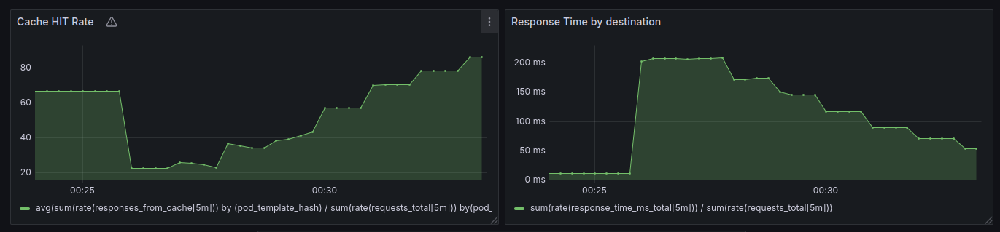
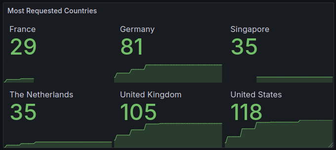
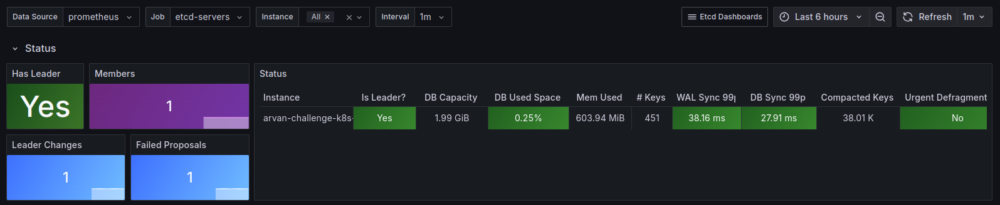

# SRE DevOps Challenge Solution

This repository contains code and configuration for the SRE DevOps interview challenge, covering the setup and deployment of a k3s cluster, monitoring and alerting system, PostgreSQL cluster, and IP location service with caching and metrics. The project is designed for a local setup using Multipass as the VM hypervisor, Terraform for VM provisioning, and Ansible for automating the deployment.

## Prerequisites

### Install Multipass
To create VMs locally, install Multipass:
```bash
snap install multipass
```

## Install Terraform
Install Terraform to manage infrastructure-as-code provisioning:

```bash
wget -O- https://apt.releases.hashicorp.com/gpg | sudo gpg --dearmor -o /usr/share/keyrings/hashicorp-archive-keyring.gpg
echo "deb [signed-by=/usr/share/keyrings/hashicorp-archive-keyring.gpg] https://apt.releases.hashicorp.com $(lsb_release -cs) main" | sudo tee /etc/apt/sources.list.d/hashicorp.list
sudo apt update && sudo apt install terraform
```

## Step 1: Deploy VMs with Terraform
Navigate to the `terraform` directory and initialize, plan, and apply the Terraform configuration to create 3 VMs on Multipass:

```bash
terraform plan
terraform apply
```
Once VMs are created, use the generated IPs to update the Ansible `hosts.ini` file, which will be used for cluster setup. Optionally, run the `generate_hosts_ini.sh` script to automate this step.

## Step 2: Configure the Kubernetes Cluster with Ansible
Use Ansible to bootstrap a 3-node Kubernetes cluster with [k3s](https://k3s.io/), consisting of 1 master and 2 worker nodes.

**Run the Ansible Playbook**
In the `Ansible` directory, execute the playbook:

```bash
cd Ansible
export ANSIBLE_HOST_KEY_CHECKING=False
ansible-playbook -i hosts.ini playbook.yml 
```

## Step 3: Deploy Monitoring and Alerting System
This setup includes Prometheus, Grafana, and Alertmanager on the Kubernetes cluster. Grafana is configured with three dashboards:

* Node Exporter Dashboard
* IP Location Service Dashboard (for monitoring the IP location service)


* ETCD Dashboard


**Configure Prometheus**
Prometheus is configured to scrape metrics from:
* ETCD instances
* All kubelet services across the k3s cluster
* HTTP metrics port on all running pods

**Domains**
* Prometheus: [prometheus.arvan.mhbhm.ir](prometheus.arvan.mhbhm.ir)
* Grafana: [grafana.arvan.mhbhm.ir](grafana.arvan.mhbhm.ir)
* Alertmanager: [alertmanager.arvan.mhbhm.ir](alertmanager.arvan.mhbhm.ir)

## Step 4: Deploy PostgreSQL Cluster
A 3-node PostgreSQL cluster is deployed in the `postgres` namespace using [PostDock](https://github.com/paunin/PostDock).

**Verify the PostgreSQL Cluster**
Run the following commands to check the status of the PostgreSQL nodes:

```bash
sudo kubectl -n postgres get pod | grep db-node | awk '{print $1}' | while read pod; do echo "$pod:"; sudo kubectl -n postgres exec $pod -- bash -c 'gosu postgres repmgr cluster show'; done

sudo kubectl -n postgres get pod | grep pgpool | awk '{print $1}' | while read pod; do echo "$pod:"; sudo kubectl -n postgres exec $pod -- bash -c 'PGCONNECT_TIMEOUT=10 PGPASSWORD=pool_password psql -U replica_user -h 127.0.0.1 template1 -c "show pool_nodes"'; done
```

## Step 5: Deploy the IP Location Service
This Go-based service retrieves the country of a given IP address, with caching in PostgreSQL to reduce external API calls for repeated requests. The service exposes metrics and provides caching behavior for improved efficiency.

**Testing the IP Location Service**
Test the service by making a request to its `/get-country` endpoint:

```bash
curl ip-location.arvan.mhbhm.ir/get-country -H 'content-type: application/json' -d '{"ip": "1.1.1.1"}'
```

* Response format:
```json
{
    "country": "Australia",
    "requested_ip": "1.1.1.1",
    "fetched_from_database": false
}
```
* The `fetched_from_database` field will be `true` if the response is fetched from the database.

**Additional Testing**
Use the `ip-location/test_random_ips.sh` script to generate random IPs and send test requests to the service.

**Metrics**
The IP Location service also exposes custom metrics on port `9999` at the `/metrics` endpoint:

* `requests_total`: Total number of requests
* `response_time_ms_total`: Total response time in milliseconds
* `responses_from_cache`: Total number of requests that responded with cache

**Sample Metrics Output**
```plaintext
# HELP requests_total Total number of requests
# TYPE requests_total counter
requests_total 286
# HELP response_time_ms_total Total response time in milliseconds
# TYPE response_time_ms_total counter
response_time_ms_total 68806
# HELP responses_from_cache Total number of requests that responded with cache
# TYPE responses_from_cache counter
responses_from_cache 21
```

You can see the full metrics on [prometheus](prometheus.arvan.mhbhm.ir) or using this curl:
```bash
curl ip-location.arvan.mhbhm.ir/metrics
```

## Notes
All deployments and configurations, including service and database setup, are fully automated using Ansible roles located in the Ansible directory.

